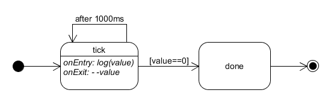

Ryle
====
A full hierarchical Finite State Machine (fsm).

##What?  Another state machine library?
Yes, I know, there are a lot.  This has a lot of the features of the others, plus a few more (I think):
- Understands, and is built on, promises.
- Can be used with any event, pubsub or signal libraries
- Properly hierarchical with all standard UML model state transitions supported
  - Nested state transitions fire exit and enter methods through the full path in order
  - A state can transition to itself and a parent state can define persistent transitions to sub-states.
- Reusable and composable
  - A state machine is defined once and then many instances of it can be run.
  - An existing state machine can be nested within another.
  - Abstract states can be defined which are then instantiated by a parent machine.

Above all I found many of the other fsm libraries required machine definition code which was not easy to read.
The easier code is to read then in general it is simpler to maintain and for others to follow.  I've tried to make resultant state definition code to be as readable as possible.

## Why Ryle?
I wanted to base the name on the phrase ['Ghost in the Machine'](https://en.wikipedia.org/wiki/Ghost_in_the_machine) which originated from the book ['The Concept of Mind'](https://en.wikipedia.org/wiki/The_Concept_of_Mind) by Gilbert Ryle, a British Philosopher.
   Ghost was already taken.
   
## Installation
```
  npm install ryle --save
```

##Usage

All the examples will be included in the `examples` folder along with uxf state diagrams.

### Countdown Example

Implements the following state machine:


  
```
var ryle=require('ryle');

//define a state machine
var countdown=ryle({

  //the start must be a getter function returning the initial state
  get _start(){return this.tick},

  //this is the main state.  It transitions to itself every second and to done when complete
  tick: function(context){
    console.log(context.value);
    return ryle
      .on(!context.value,this.done)
      .onTimeout(1000, this.tick)
      .onExit(function(){--context.value});
  },
  done: function(){
    return ryle.exit();
  }
});

//Now to use the state machine
countdown(10).then(function(){console.log('Boom!')}); 
```  
 
## Tests
 
```
   npm test
```

## Contributing
 In lieu of a formal styleguide, take care to maintain the existing coding style.
 Add unit tests for any new or changed functionality. Lint and test your code.

## Notes
I'm refactoring this from code I use for our production web-app.  So far it has been added as-is and is fully functional, but needs a little TLC to make it more maintainable.

## Release History
- 0.1.0 Initial release